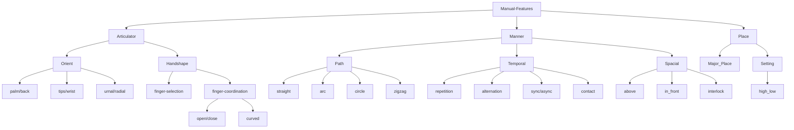

# Automated Sign Language Feature Extraction

This tool extracts features from sign language videos for the purpose of sign language recognition. The features extracted by this tool can be used by a variety of machine learning algorithms to recognize sign language gestures.

The features extracted by this tool can be used to enhance sign language recognition models by providing a more linguistically coherent latent space. This is because the features are extracted in a way that takes into account the linguistic properties of sign language, such as the relationship between handshapes, movements, and meaning. This can help to improve the accuracy of sign language recognition models, as they will be better able to distinguish between different signs that are similar in appearance but have different meanings.

## Demo

https://github.com/karahan-sahin/Automated-Sign-Language-Feature-Extraction/assets/53216998/b27b8515-1a98-4122-a4ce-8bc17c520bc1

------

## Features
The following feature tree defined at <a href="https://harry-van-der-hulst.uconn.edu/wp-content/uploads/sites/1733/2021/04/169-Sign-language-phonology.pdf">Van der Hurst(2001)</a>  are extracted by this tool:



## Installation

The requirement for running the is `python>=3.9`. The installation command is given below.

```bash
git clone git@github.com:karahan-sahin/Automated-Sign-Language-Feature-Extraction.git
conda env --name asl-fe python3.9
conda activate asl-fe
pip install -r requirements.txt
```

After setting up the environment, you can run the user-interface with the command below:


## Usage

The module can be either used via user-interface:
```bash
streamlit run main.py
```
Before you starting your


Or the linguistic-feature extraction library:

```
import os
import sys
from lib.phonology.temporal import TemporalPhonology
from lib.phonology.handshape import HandshapePhonology

current_path = os.path.dirname(os.path.abspath(__file__))
sys.path.append(os.path.join(current_path, "Automated-Sign-Language-Feature-Extraction/lib"))

LEFT = HandshapePhonology('Left')
RIGHT = HandshapePhonology('Right')
TEMPORAL = TemporalPhonology(PARAMS['selected'])
```


## Requirements
This tool requires the following Python libraries:
- OpenCV
- NumPy
- SciPy

## License

This tool is released under the MIT License.

